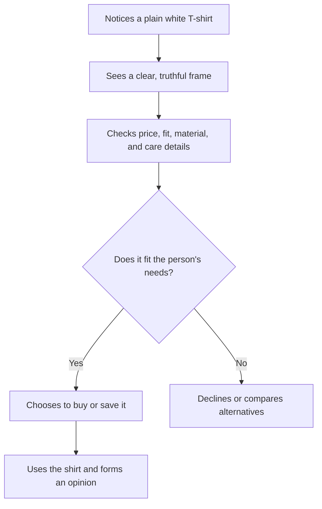

# Chapter 1: Persuasion and Human Decision-Making

Persuasion is the ethical effort to shape how people **notice**, **interpret**, **trust**, and **act** on information. It is part of ordinary life: a friend recommends a movie, a student argues for a later deadline, and a designer helps a shopper understand why a product may fit their needs.

Good persuasion does not mean making everyone say yes. It means presenting a clear, truthful case so people can make an informed choice.

## Persuasion, Coercion, and Manipulation

Persuasion respects the other person's ability to choose. Coercion removes or severely limits that choice through force, threats, or punishment. Manipulation may leave a technical choice available, but it hides important information, exploits confusion, or uses pressure the audience would not reasonably accept if it were visible.

For example, saying "This white T-shirt is made from heavier cotton and may last longer" is persuasion when the claim is true. Hiding a required subscription in tiny text, or falsely claiming that the shirt is almost sold out, is manipulation. The product did not change; the honesty of the communication did.

An ethical designer aims for understanding and a voluntary decision. A useful test is: would I be comfortable explaining this message and its design choices openly to the audience?

## Cialdini's Principles of Influence

Psychologist Robert Cialdini describes several recurring patterns that can influence decisions. They are not magic buttons; they are shortcuts people often use when time and attention are limited.

- **Reciprocity:** People often want to return a helpful gesture. A useful size guide can build goodwill; it should not create a hidden obligation to buy.
- **Commitment and consistency:** After making a small, voluntary choice, people may prefer later choices that fit it. Letting someone save preferred shirt colors can make later comparison easier.
- **Social proof:** People look to others, especially when uncertain. Genuine customer reviews or accurate sales data can reduce uncertainty.
- **Liking:** We are more open to people and brands we find relatable, respectful, or familiar. Clear, welcoming language can help.
- **Authority:** Relevant expertise can make information more credible. A fabric specialist's care advice is more useful than an unrelated celebrity's unsupported claim.
- **Scarcity:** Limited availability can make an option feel more valuable or urgent. It is ethical only when the limit is real and clearly described.
- **Unity:** Shared identity or membership can increase trust and cooperation. A campus organization may speak to students as fellow community members, without implying that outsiders do not belong.

## A Few More Useful Ideas

### Framing

Framing is the angle used to present the same information. A plain white T-shirt can be framed as a durable everyday basic, a simple canvas for screen printing, or a minimal wardrobe staple. Each frame draws attention to a different value, but ethical framing does not make false promises or conceal relevant tradeoffs. If it shrinks easily, that matters in every frame.

### Choice Architecture and Defaults

Choice architecture is the way options are arranged: their order, labels, defaults, and the effort needed to choose them. For example, a clothing site might preselect the most common size based on a shopper's saved preference. That can be helpful if it is easy to change and the selection is visible. A harmful default would quietly add an unwanted item or charge.

### Cognitive Ease

People are more likely to understand and use information that is easy to process. Short headings, readable type, plain product details, and a clear return policy can lower confusion. Ease should clarify a decision, not distract someone from a cost or limitation.

## How a Simple Decision Can Unfold

The designer can influence the clarity of steps B and C. The buyer still controls the choice at step D.

## Principles in Practice

| Principle or idea | Mechanism | Ethical use | Misuse risk |
| --- | --- | --- | --- |
| Reciprocity | A helpful gesture can encourage a response. | Offer an honest fit guide or useful care advice. | Treating a free gift as a hidden debt. |
| Commitment and consistency | Small choices can shape later preferences. | Let shoppers voluntarily save a size or favorite. | Making cancellation or reversal difficult. |
| Social proof | Other people's choices can reduce uncertainty. | Show verified, representative reviews. | Using fake reviews or misleading counts. |
| Authority | Relevant expertise can increase trust. | Identify qualified sources for material or care claims. | Borrowing status without relevant evidence. |
| Scarcity | A real limit can create urgency. | State a genuine limited run and its end date. | Inventing countdowns or false low-stock notices. |
| Framing | The presentation directs attention to certain benefits. | Describe the shirt honestly as durable, printable, or minimal. | Highlighting benefits while hiding important downsides. |
| Choice architecture | Layout and defaults affect effort and attention. | Use visible, reversible defaults that help users. | Preselecting unwanted purchases or sharing. |

## Questions to Ask Before Trying to Persuade

- What decision am I asking someone to make, and do they have a real choice?
- What evidence supports each important claim?
- What costs, limits, or tradeoffs should they know before deciding?
- Does the design make important information easy to find and understand?
- Would this message still feel fair if the audience knew exactly how it was designed to influence them?
- Who might be harmed, excluded, rushed, or confused by this approach?

## Explore Further

If you want to research these ideas, try searches such as:

- `Robert Cialdini principles of influence reciprocity scarcity`
- `choice architecture behavioral economics defaults`
- `framing effect psychology communication`
- `ethical persuasive design examples`

## What You Should Remember

Persuasion can help people pay attention, understand value, build trust, and take action. Its ethical boundary is respect: be truthful, make choices voluntary, and do not hide the information someone needs. The same white T-shirt can mean different things through framing, but responsible persuasion changes the explanation—not the facts.
