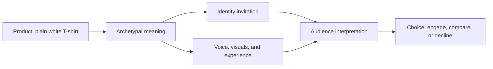

# Chapter 2: Brand Archetypes and Meaning

A brand archetype is a practical storytelling framework that helps a product, organization, or experience feel recognizable. It draws on familiar cultural and narrative patterns: the explorer seeking freedom, the caregiver offering support, or the creator making something new. An archetype can guide a brand's voice, images, promises, and customer experience.

The practical question is not simply, "Which label fits us?" It is: **What does the audience get to feel, imagine, or become by choosing this brand?**

## Archetypes Are Not Destiny

Archetypes are models, not literal personality diagnoses. They do not prove what a person or organization "really is," and they should not trap people into a rigid category. A brand can combine tendencies: a company might use a Caregiver tone in customer support and a Creator tone in its products.

Cultural context matters too. An image, joke, color, or idea of success may carry different meanings for different audiences. Treat archetypes as a starting point for research and thoughtful design, then listen to the people the brand hopes to serve.

## Common Brand Archetypes

| Archetype | Central idea | What the audience may feel or imagine | Possible expression for a plain white T-shirt |
| --- | --- | --- | --- |
| Explorer | Freedom and discovery | Independent, ready to go somewhere new | A packable travel basic for an unplanned weekend. |
| Sage | Knowledge and understanding | Informed, thoughtful, discerning | A clearly documented shirt with straightforward material and care information. |
| Creator | Imagination and making | Original, capable, expressive | A blank, print-ready shirt presented as a canvas for a design. |
| Ruler | Control and achievement | Polished, confident, in command | A precisely cut premium staple for a carefully organized wardrobe. |
| Caregiver | Support and protection | Comfortable, cared for, included | A soft, dependable shirt described with comfort and easy care in mind. |
| Rebel | Independence from convention | Defiant, authentic, unwilling to conform | A deliberately plain shirt that rejects loud logos and trends. |
| Hero | Courage and mastery | Strong, ready to meet a challenge | A hard-wearing training or volunteer-event shirt. |
| Everyperson | Belonging and practicality | Welcome, relatable, part of everyday life | An affordable everyday shirt for ordinary routines. |
| Innocent | Simplicity and optimism | Calm, hopeful, uncomplicated | A clean white essential with a light, simple presentation. |
| Jester | Play and spontaneity | Amused, relaxed, ready to join in | A white shirt promoted as the starting point for a funny DIY costume. |
| Lover | Connection and appreciation | Seen, attractive, close to others | A soft, well-fitting shirt positioned for comfort and personal style. |
| Magician | Transformation and possibility | Surprised, empowered, able to change things | A blank shirt shown becoming a personal keepsake through customization. |

These are prompts for meaning, not a checklist. A brand should only promise what its product and behavior can actually support.

## One Product, Different Meanings

The physical shirt below is identical in each example: plain, white, and made from the same material. What changes is the story around it and the experience the audience is invited to imagine.

### Explorer: The Go-Anywhere Basic

"One clean shirt for the road." Photos might show the shirt folded into a small bag beside a map and water bottle. The audience is invited to feel independent and ready for an unexpected trip. This positioning should be backed by useful details, such as packing or care information, rather than vague claims about adventure.

### Creator: The Blank Canvas

"Start with white. Make it yours." The same shirt is presented with fabric markers, screen-printing ink, or a student design project. The audience gets to imagine becoming a maker. The brand should show what customization methods actually work and any limits of the fabric.

### Everyperson: The Reliable Everyday Shirt

"A simple shirt for busy days." The focus is practical fit, easy comparison, and a clear price. The audience gets to feel included rather than pressured to be exceptional. Honest sizing and availability matter more here than a dramatic story.

### Rebel: The No-Logo Statement

"Nothing shouting for attention." The shirt becomes a choice against visible branding or fast-changing trends. The audience is invited to feel self-directed. The message should avoid pretending that buying any product automatically makes someone rebellious.

## From Product to Audience

The diagram is a reminder that an archetype does not control the audience. A designer proposes meaning through words and experiences; people interpret that proposal through their own needs, values, and culture.

## Questions to Ask When Choosing an Archetype

- What real need, hope, or situation does this archetype help us address?
- What does the audience get to feel, imagine, or become—and is that invitation respectful?
- Can the product, service, and customer experience honestly deliver the promise?
- Which archetypes already appear in our voice, visuals, and actions?
- Could this framing exclude, stereotype, or confuse part of the audience?
- How might the message change across cultural contexts or communities?
- What evidence from audience research supports this choice?

## What You Should Remember

Brand archetypes are useful patterns for giving a product recognizable meaning. They are not fixed personality labels or shortcuts around audience research. The same plain white T-shirt can represent discovery, creativity, practicality, or rebellion depending on its framing. Choose an archetype that fits a real audience need, make promises the brand can keep, and leave room for people to interpret the brand in their own way.
