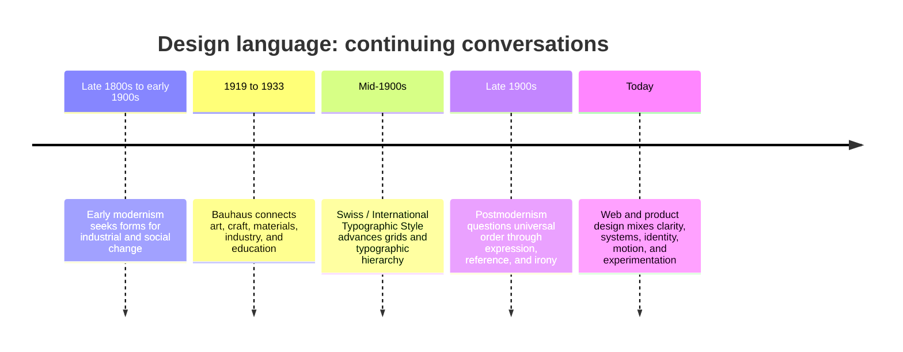

# Chapter 3: Design Language

Visual design carries ideas before a reader finishes reading the words. Type, color, spacing, images, texture, and layout can make something feel calm, official, playful, exclusive, urgent, familiar, or strange. This collection of choices is often called a **design language**: a recognizable way of making meaning through visual form.

Design language is not decoration added after the “real” message. It helps decide what the message seems to be, who it appears to be for, and whether people trust it enough to keep looking.

## A Short Historical Narrative

Early modernism developed alongside rapid industrial and social change in the late nineteenth and early twentieth centuries. Many artists, architects, and designers searched for forms that suited modern materials, mass production, and new ways of living. Although modernism was never one single style, it often valued reduction, structure, and a close relationship between form and purpose.

The Bauhaus, a German school active from 1919 to 1933, became an important site for experiments connecting art, craft, industry, architecture, and design education. Its work is often associated with geometric form, material study, functional thinking, and the hope that good design could participate in everyday life.

Later, the Swiss or International Typographic Style developed strongly in the mid-twentieth century. It emphasized grids, asymmetrical layouts, sans-serif type, photography, and clear hierarchies. Its designers sought communication that could be orderly and broadly understandable across audiences. In practice, a grid helped designers make complex information easier to scan and organize.

Postmodern design emerged partly as a reaction against modernist certainty, restraint, universality, and order. Designers questioned whether one clean visual language could really speak for everyone. Postmodern work could use quotation, humor, historical references, collision, ornament, expressive type, and deliberate contradiction. It did not simply replace modernism; it opened up arguments about who design serves and what counts as clarity.

Contemporary web and product design still lives inside this conversation. A banking app may use a restrained grid and plain language to support trust, while a music site may use dense color, motion, and expressive type to signal identity and discovery. Neither approach is automatically better. The useful question is whether the design choices fit the audience, task, content, and ethical stakes.

## The Continuing Tensions

| Tension | One end of the spectrum | Other end of the spectrum | A contemporary design question |
| --- | --- | --- | --- |
| Order and disruption | Predictable structure and repeated rules | Surprise, interruption, and collision | Does disruption create useful attention or just confusion? |
| Universality and identity | Broadly shared conventions | Specific cultural, community, or personal signals | Who might feel included or overlooked by this visual language? |
| Clarity and expression | Fast understanding and low friction | Mood, personality, and emotional force | Can the work be expressive without hiding essential information? |
| Grid and anti-grid | Aligned modules and stable hierarchy | Overlap, irregularity, and deliberate rule-breaking | Does the layout guide the eye even when it breaks a grid? |
| Restraint and abundance | Limited color, type, and imagery | Layering, ornament, density, and variety | What deserves emphasis, and what becomes visual noise? |
| Function and irony | Direct purpose and sincere instruction | Playful distance, quotation, or contradiction | Could irony make an important message harder to understand? |

These are not “old versus new” choices. A strong interface might use a strict grid for settings and a disruptive illustration for a campaign. Design is often the work of deciding where consistency helps and where a break in the pattern communicates something important.

## A Timeline of Ideas, Not a Style Checklist

The timeline simplifies a complicated history. Styles overlap, travel, and change; designers in different places have not all followed one sequence.

## The Same White T-Shirt, Two Design Languages

Imagine the exact same plain white T-shirt—same cotton, fit, price, and care instructions.

A **modernist presentation** might use a generous white background, a single front-facing product photo, a neutral sans-serif typeface, and a neat grid. The headline could be “Everyday Cotton T-Shirt.” Size, material, price, and care information would be easy to compare. The shirt feels precise, practical, and dependable.

A **postmodern presentation** might layer cropped photographs, oversized type, clashing bright colors, a hand-drawn doodle, and a playful headline such as “WHITE, BUT NOT QUIET.” The shirt itself is unchanged, but it can feel expressive, self-aware, and connected to a particular scene or attitude. The design still has an ethical job: price, sizing, and care details must remain findable and readable.

The point is not that one version is honest and the other is not. Both can be honest. Their different design languages invite different interpretations of the same object.

## How to Read a Design

Start by describing what is actually present before deciding what it means.

- **Notice:** What do you see first? Identify type, images, color, scale, alignment, empty space, motion, and repetition.
- **Trace hierarchy:** What appears most important, next most important, and easiest to miss? How does the layout direct your eye?
- **Name the signals:** Does the design suggest authority, simplicity, luxury, rebellion, care, speed, or something else? Which choices create that impression?
- **Connect form to purpose:** What action or understanding does the design appear to ask for? Is the visual style helping that task?
- **Test the audience:** Who may recognize these references or conventions? Who may find them inaccessible, distracting, or unfamiliar?
- **Check the facts:** Are essential details legible, accurate, and given appropriate visual weight?

Reading design is interpretation, not mind-reading. State what you observe, explain the connection you infer, and stay open to other reasonable readings.

## Museum Research

Museum and institutional collections can give you authentic examples to study, but do not assume a search result is evidence by itself. Find the object record, read its collection information, and verify the maker, date, medium, and institutional source before using it in class work.

Try searches such as:

- `site:metmuseum.org collection modernist graphic design poster`
- `site:moma.org collection Bauhaus typography`
- `site:cooperhewitt.org collection Swiss typography poster`
- `site:vam.ac.uk collections postmodern graphic design`
- `Bauhaus archive collection typography poster`
- `museum collection International Typographic Style graphic design`

You can also search a credible museum or archive’s own collection page for terms such as “grid,” “sans serif,” “Bauhaus,” “Swiss Style,” “postmodern graphic design,” or “typographic poster.” Verify the actual object yourself, then record the collection name and the facts supplied by that institution. Do not invent an object, date, quotation, or link when you cannot verify it.

## What You Should Remember

Design language uses visual choices to carry ideas. Modernism, Bauhaus thinking, and Swiss typography made powerful cases for structure, function, and clarity; postmodernism challenged the idea that one ordered, universal language could fit every audience. Contemporary design continues to negotiate order and disruption, universality and identity, clarity and expression, grid and anti-grid, restraint and abundance, and function and irony. Read those choices carefully, then use them deliberately.
