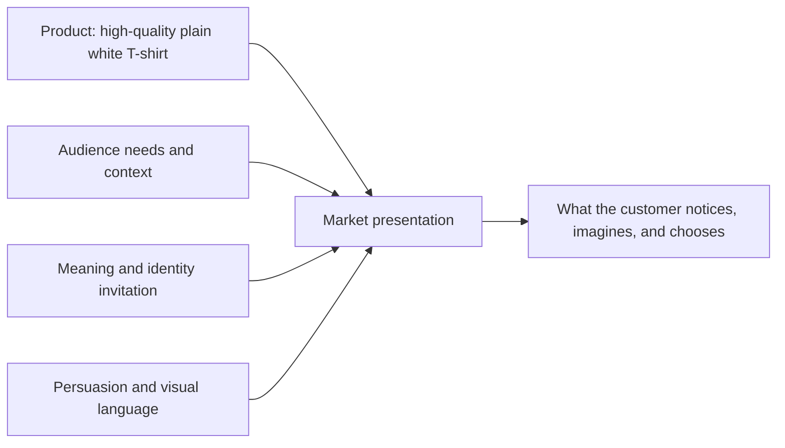

# Chapter 4: One White T-Shirt, Four Different Worlds

Meet our imaginary product: an ordinary, high-quality plain white T-shirt. It has the same fabric, cut, construction, price range, and care instructions in every concept in this chapter. No secret upgrade occurs between versions.

So why might one shopper see it as a travel companion, another as a creative tool, another as a dependable uniform, and another as a small act of rebellion? Because a market presentation combines a product with an audience, a story, persuasive cues, and a visual language. The shirt stays put; the meaning moves around it.

## The Formula Behind a Presentation

This is not a machine for controlling people. The customer can reject the story, compare options, or decide that a T-shirt is just a T-shirt. Ethical design makes the invitation clear without hiding useful facts.

## Concept 1: The Weekend Escape

**Audience:** Students and young adults who value flexible plans, short trips, and a lighter way of owning things.

**Chosen brand archetype:** Explorer.

**Persuasion principles:** Framing focuses attention on independence and readiness. Cognitive ease appears through a simple packing list and clear care details. Social proof could appear as genuine, labeled customer travel photos—but only if they are real and permission is given.

**Visual-design language:** Airy photography, open landscape, a limited natural color palette, generous space, and a simple map-like line motif. The layout feels open rather than crowded.

**Headline:** “Leave Room for Somewhere Else.”

**Short product story:** This is the shirt you pull from a clean drawer before a two-day trip with no overplanned itinerary. It is presented as an uncomplicated staple: one less thing to debate while you decide where to go.

**Imagery direction:** A shirt folded beside a small bag, train ticket, water bottle, and worn paperback; wide outdoor scenes should support the mood without falsely implying special performance features.

**Meaning the customer is invited to buy:** “I am adaptable, curious, and ready to go.”

**Ethical concern or possible misuse:** Adventure imagery can exaggerate a basic garment into a promise of transformation. Do not imply that buying the shirt makes a person more courageous, worldly, or environmentally responsible without evidence.

## Concept 2: The Quiet Standard

**Audience:** People building a small, dependable wardrobe and shoppers who want fast, low-stress comparison.

**Chosen brand archetype:** Everyperson, with a touch of Sage.

**Persuasion principles:** Authority comes from relevant, plainly identified product information, not celebrity status. Choice architecture uses a visible size guide and an easy-to-change size selection. Commitment and consistency may help someone return to saved preferences, but must not make opting out difficult.

**Visual-design language:** Restrained modernist / Swiss-influenced design: a precise grid, neutral sans-serif type, one front-facing product image, black text on a white field, and a calm hierarchy. The page gives price, material, sizing, and care equal respect.

**Headline:** “A Good White T-Shirt.”

**Short product story:** Nothing is disguised as revolutionary. The shirt is positioned as a reliable baseline for everyday life: class, work, laundry day, and the moment when every other outfit feels too complicated.

**Imagery direction:** Even lighting, a direct full-shirt view, close details of stitching and fabric texture, and a sizing comparison that is actually readable.

**Meaning the customer is invited to buy:** “I make sensible choices, and ordinary things can be well made.”

**Ethical concern or possible misuse:** Minimalism can create a false impression that a product is automatically superior, sustainable, or universal. Plain design must not conceal unclear labor practices, a poor fit range, or a difficult return policy.

## Concept 3: Make the Blank Loud

**Audience:** Student artists, DIY fans, and people who enjoy turning ordinary objects into personal statements.

**Chosen brand archetype:** Creator.

**Persuasion principles:** Reciprocity can be an honest downloadable stencil or beginner printing guide. Commitment begins with a voluntary act such as saving a design idea. Framing shifts the shirt from “blank” to “canvas.”

**Visual-design language:** A disruptive, postmodern mix of oversized type, cut-out images, fluorescent accent colors, overlapping labels, scribbles, and intentional visual collision. The page should still keep price, fit, and care details legible.

**Headline:** “WHITE IS WHERE IT STARTS.”

**Short product story:** The shirt arrives plain because the next move belongs to the wearer. Draw on it, print it, patch it, wear it under something louder, or leave it white. Its story is unfinished on purpose.

**Imagery direction:** Cropped hands holding markers, ink, thread, or printed transfers; layered photos of prototypes and process mess; a plain shirt centered somewhere inside the visual noise so it remains identifiable.

**Meaning the customer is invited to buy:** “I am someone who makes, changes, and leaves a mark.”

**Ethical concern or possible misuse:** Expressive visuals cannot cover up unsuitable customization advice. If some inks, heat transfers, or care methods may damage the shirt, say so plainly. Also avoid presenting creativity as something only a purchase can unlock.

## Concept 4: The Anti-Logo Logo

**Audience:** Shoppers tired of conspicuous branding, trend cycles, and clothes that announce themselves before the wearer can.

**Chosen brand archetype:** Rebel.

**Persuasion principles:** Scarcity could be used only for a real limited production run. Liking may come from a direct, witty voice. Framing presents lack of a logo as a choice with meaning rather than an absence of design.

**Visual-design language:** High-contrast black-and-white, brutally direct copy, close crops, deliberately awkward alignment, and a nearly empty product image with one surprising visual interruption. It breaks rules selectively instead of becoming unreadable.

**Headline:** “NO LOGO. NO LECTURE.”

**Short product story:** The shirt does not ask to become the loudest thing in the room. It is positioned for people who want to choose their own signals, including the signal of not displaying a brand mark.

**Imagery direction:** A figure in a crowded, logo-heavy setting, with the white shirt acting as a quiet visual pause; avoid mocking people who enjoy visible branding.

**Meaning the customer is invited to buy:** “I decide what represents me.”

**Ethical concern or possible misuse:** Selling rebellion can become its own form of conformity. Avoid claiming that a plain shirt makes someone more authentic than other people, and never invent low-stock urgency to force a purchase.

## Synthesis: Same Shirt, Different Invitation

| Concept | Audience | Archetype | Persuasion focus | Visual language | Customer is invited to buy | Main ethical risk |
| --- | --- | --- | --- | --- | --- | --- |
| The Weekend Escape | Flexible travelers and students | Explorer | Framing, cognitive ease, truthful social proof | Open space, natural palette, travel cues | Adaptability and curiosity | Turning a basic shirt into a false promise of adventure |
| The Quiet Standard | Practical wardrobe builders | Everyperson / Sage | Clear authority, choice architecture, voluntary commitment | Restrained modernist / Swiss-influenced grid | Practical confidence | Letting clean design hide important limits |
| Make the Blank Loud | DIY and art-minded shoppers | Creator | Reciprocity, voluntary commitment, framing | Disruptive postmodern layering and bright contrast | Creative agency | Hiding customization limits or treating purchase as creativity itself |
| The Anti-Logo Logo | People resisting conspicuous branding | Rebel | Honest scarcity, liking, framing | Stark contrast and selective rule-breaking | Self-direction | Selling superiority or fake rebellion |

## What Changes—and What Does Not

All four presentations can truthfully describe the same material facts. What changes is emphasis: an Explorer story emphasizes possibility, a modernist presentation emphasizes dependable information, a Creator story emphasizes transformation, and a Rebel story emphasizes independence.

This is why designers have responsibility. A presentation can make an ordinary object feel meaningful, but it should not pressure people with false urgency, fake reviews, hidden costs, or promises the shirt cannot keep. The best version gives a person a useful story **and** enough honest information to decide whether that story is right for them.

## What You Should Remember

Products do not arrive with one fixed meaning. Product quality matters, but audience, archetype, persuasion, and visual language shape the interpretation around it. The plain white T-shirt became four different market presentations without materially changing. Use that power to clarify a real value and invite a voluntary choice—not to manufacture pressure or hide the facts.
